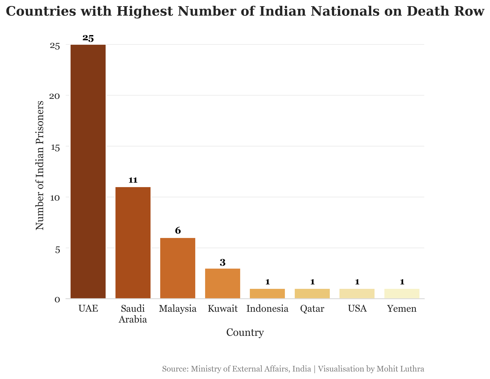
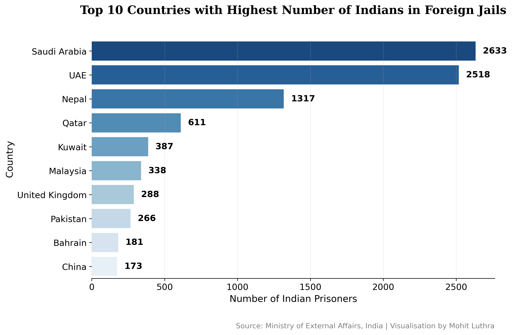
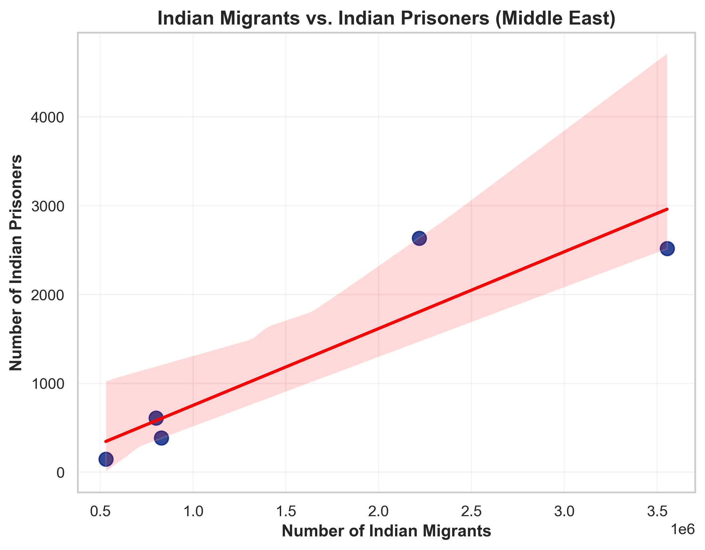
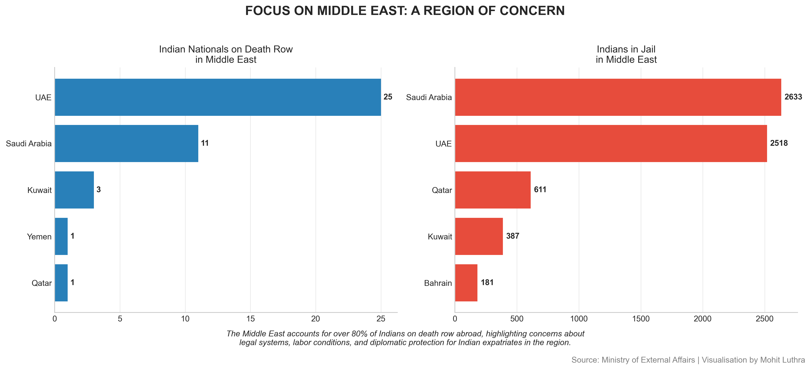

# Indian Prisoners Abroad: A Silent Crisis


## 📊 Data Analysis Project: Unveiling the Numbers, Stories, and the Urgent Need for Action

This repository contains a comprehensive data analysis of Indian nationals incarcerated abroad, with particular focus on those facing death sentences. Using Python, Pandas, Matplotlib, Seaborn, and Plotly, this project explores the alarming trends of Indian imprisonment rates, especially in Middle Eastern countries.

## 🔍 Project Overview

This analysis reveals a concerning situation where:
- **49+** Indian nationals are on death row abroad
- **10,152+** Indians are in foreign jails
- Over **80%** of death sentences are in Middle Eastern countries
- UAE has the highest number of Indians on death row (**25**)
- Saudi Arabia holds the highest number of Indian prisoners (**2,633**)

## 📈 Key Visualizations

### Geographic Distribution of Death Row Cases

The concentration of Indian nationals on death row is heavily skewed toward Gulf countries:



1. UAE: 25 (51% of total)
2. Saudi Arabia: 11 (22.4% of total)
3. Malaysia: 6 (12.2% of total)
4. Kuwait: 3 (6.1% of total)
5. Others (Indonesia, Qatar, USA, Yemen): 1 each (2% each)

### Top Countries Imprisoning Indian Nationals



The data shows:
1. Saudi Arabia: 2,633
2. UAE: 2,518
3. Nepal: 1,317
4. Qatar: 611
5. Kuwait: 387

### Correlation Between Migration and Imprisonment

A statistical analysis reveals a strong positive correlation (r = 0.914, p = 0.0297) between the number of Indian migrants in Middle Eastern countries and the number of imprisoned Indians.



## 🔎 The Middle East Connection

The data clearly demonstrates a troubling pattern: over 80% of Indians on death row abroad and the majority of imprisoned Indians are located in Middle Eastern countries. This region employs millions of Indian migrant workers, primarily in construction, domestic work, and service industries.

### Deep Dive: UAE and Saudi Arabia



**United Arab Emirates**
- 25 Indians on death row
- 2,518 in prison
- Typical profile: Low-skilled laborers, domestic workers, small business operators
- Common charges: Financial crimes, drug offenses

**Saudi Arabia**
- Houses 2,633 Indian prisoners (highest number)
- 11 on death row
- Common issues: Violation of religious laws, drug-related offenses, labor disputes, alleged theft

## 👨‍👩‍👧‍👦 Human Stories Behind the Statistics

While the data provides a macro view, each number represents a human tragedy affecting entire families back in India. Some representative cases include:

1. **Rajesh K.**: A truck driver in Saudi Arabia, jailed after making a tearful video about terrible work conditions
2. **Sunita M.**: A domestic worker in Kuwait imprisoned after being accused of theft, with limited access to legal representation
3. **Arjun S.**: Facing death row in Saudi Arabia on drug smuggling charges, claims he was unaware of the contents of a package he was asked to deliver

## 📊 Data Analysis Methodology

This project utilized:

- **Python** for data processing and analysis
- **Pandas** for data manipulation and statistical analysis
- **Matplotlib & Seaborn** for standard data visualizations
- **Plotly** for interactive visualizations
- **Statistical analysis** including Pearson correlation coefficient to identify significant relationships

### Correlation Analysis Example
```python
import pandas as pd
import numpy as np
from scipy.stats import pearsonr
import matplotlib.pyplot as plt
import seaborn as sns

# Sample data
data = {
    'Country': ['UAE', 'Saudi Arabia', 'Kuwait', 'Qatar', 'Oman'],
    'Indian_Migrants_Lakhs': [35.54, 22.19, 8.29, 8.00, 5.30],
    'Indian_Prisoners': [2518, 2633, 387, 611, 181]
}

df = pd.DataFrame(data)

# Calculate correlation
correlation, p_value = pearsonr(df['Indian_Migrants_Lakhs'], df['Indian_Prisoners'])
print(f"Pearson correlation coefficient (r): {correlation:.3f}")
print(f"p-value: {p_value:.4f}")

# Visualization
plt.figure(figsize=(10, 6))
sns.regplot(x='Indian_Migrants_Lakhs', y='Indian_Prisoners', data=df)
plt.title('Correlation between Indian Migrants and Prisoners in Middle East')
plt.xlabel('Number of Indian Migrants (in Lakhs)')
plt.ylabel('Number of Indian Prisoners')
plt.annotate(f'r = {correlation:.3f}, p = {p_value:.4f}', 
             xy=(0.05, 0.95), xycoords='axes fraction')
plt.tight_layout()
plt.savefig('correlation_chart.png', dpi=300)
plt.show()
```

## 🔑 Key Findings

1. Over 80% of Indian nationals on death row are in Middle Eastern countries
2. UAE (25) and Saudi Arabia (11) account for 73% of all death sentence cases
3. Gulf countries employ large numbers of Indian migrant workers, often in vulnerable conditions
4. There is a statistically significant, strong positive correlation between Indian labor migration and the number of imprisoned Indians in the Middle East
5. Southeastern Asian countries like Malaysia have strict drug laws resulting in death sentences
6. Consular access and legal support remain challenging in many countries
7. Many cases involve alleged drug trafficking, often with claims of deception or coercion
8. Diplomatic relations heavily influence prisoner treatment and potential pardons

## 📋 Policy Recommendations

Based on the data analysis, this project recommends:

1. Strengthen consular services in countries with high Indian prisoner populations
2. Create a dedicated legal aid fund for Indians facing capital punishment abroad
3. Enhance pre-departure orientation about local laws for workers going to Gulf countries
4. Negotiate bilateral prisoner transfer agreements with more countries
5. Implement a tracking system for Indians detained abroad
6. Establish legal assistance hotlines in countries with significant Indian populations
7. Engage with diaspora organizations to provide community support systems
8. Form specialized diplomatic teams focused on death penalty cases

## 🛠️ Tools & Technologies Used


## 📚 Data Sources

1. Indian Prisoners in Foreign Jail Data: Ministry of External Affairs, India
2. Indian Migrants Data: Ministry of External Affairs, India
3. Human Stories: News articles and reports from:
   - India Today
   - Deccan Herald 
   - Migrant Rights
   - Economic Times

## 👨‍💻 About the Author

This case study was created by Mohit Luthra as part of a data analysis portfolio.

[](https://linkedin.com/in/yourprofile)
[](https://github.com/yourusername)
[](mailto:your.email@example.com)

---

⭐ If you found this analysis insightful, please star this repository!
